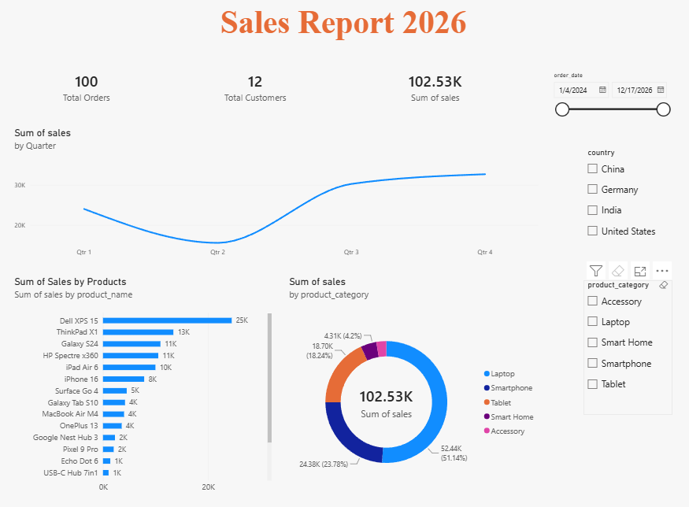

# 📊 Sales Performance Dashboard 2026

An interactive Power BI dashboard designed to analyze sales performance, customer activity, product performance, and category-level sales.

## 🚀 Dashboard Preview



## 📌 Project Overview

This project uses Microsoft Power BI to transform sales data into an interactive business intelligence dashboard.

The dashboard provides an overview of:

- Overall sales performance
- Quarterly sales trends
- Product-level sales performance
- Product category contribution
- Total orders and customers
- Sales analysis by country
- Date-based sales analysis

## 📈 Key Performance Indicators

| KPI | Value |
|---|---:|
| Total Orders | 100 |
| Total Customers | 12 |
| Total Sales | 102.53K |

## 📊 Dashboard Analysis

### Quarterly Sales Trend

The quarterly sales visualization shows changes in sales performance across the four quarters.

### Product Performance

The product-level visualization identifies the products contributing the most to total sales.

The highest-selling products include:

- Dell XPS 15
- ThinkPad X1
- Galaxy S24
- HP Spectre x360
- iPad Air 6

### Sales by Product Category

The dashboard provides a category-level breakdown of sales across:

- Laptop
- Smartphone
- Tablet
- Smart Home
- Accessory

Laptops represent the largest share of total sales in the dashboard.

## 🎛️ Interactive Filters

The dashboard includes filters for:

- Order Date
- Country
- Product Category

These filters allow users to explore different segments of the sales data.

## 🛠️ Tools & Technologies

- Microsoft Power BI
- Power Query
- DAX
- Data Cleaning
- Data Transformation
- Data Visualization

## 📁 Repository Structure

```text
power-bi-sales-dashboard/
│
├── Dashboard/
│   └── Sales Report 2026.pbix
│
├── Screenshots/
│   └── sales-dashboard.png
│
└── README.md